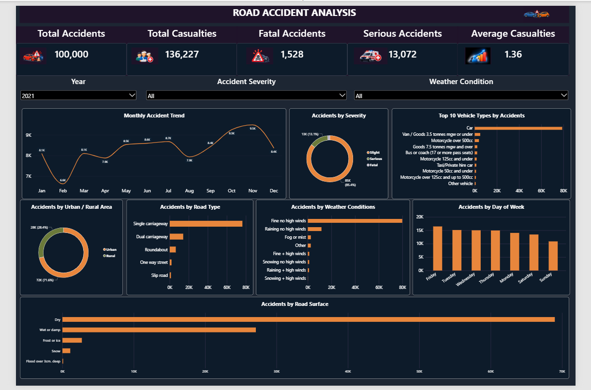
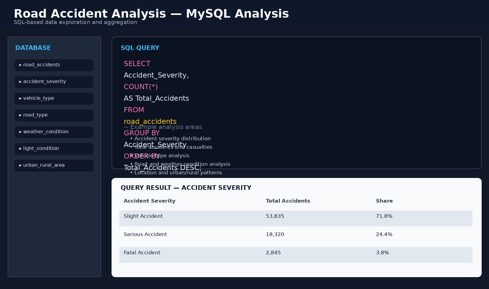
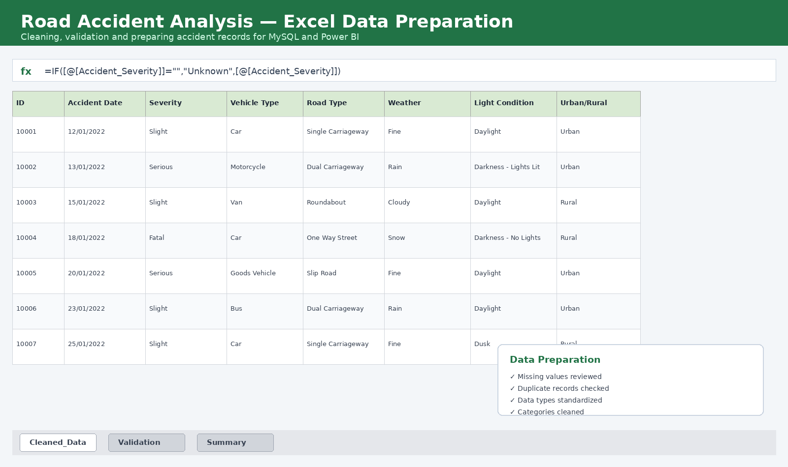

# 🚦 Road Accident Analysis Dashboard

### Analyzing Road Accident Patterns and Safety Insights Using Excel, MySQL & Power BI

---

## 📌 About the Project

The **Road Accident Analysis Dashboard** is a data analytics and business intelligence project developed to analyze road accident data and identify meaningful patterns and trends.

The project focuses on accident frequency, casualties, accident severity, vehicle types, road types, weather conditions, road surface conditions, urban and rural areas, and other accident-related factors.

The project combines **Excel, MySQL, and Power BI** to transform raw accident data into meaningful and easy-to-understand insights.

---

## 🎯 Project Objectives

The main objectives of this project are:

- Analyze road accident patterns and trends.
- Analyze accident severity and casualties.
- Identify patterns based on vehicle types.
- Analyze accidents across different road types.
- Study accident patterns under different weather conditions.
- Analyze road surface conditions.
- Compare accident patterns between urban and rural areas.
- Analyze accident patterns by day of the week.
- Perform SQL-based analysis using MySQL.
- Create an interactive Power BI dashboard.
- Convert raw accident data into meaningful analytical insights.

---

## 🛠️ Technologies & Tools

- **Microsoft Excel** – Data preparation, cleaning and initial analysis
- **MySQL** – Data storage and SQL-based analysis
- **Power BI** – Interactive dashboard and data visualization
- **DAX** – Calculated measures and KPIs
- **CSV** – Dataset storage and data exchange

---

## 📊 Dataset

The project uses a cleaned road accident dataset containing approximately **75,000 records**.

The dataset contains information related to:

- Accident severity
- Accident date and time
- Number of casualties
- Number of vehicles
- Vehicle type
- Road type
- Road surface conditions
- Weather conditions
- Light conditions
- Urban/Rural area
- Junction information
- Location-related information
- Other accident characteristics

---

## 🔄 Project Workflow

The complete project follows this workflow:

**Raw Data → Data Cleaning → Excel → MySQL → SQL Analysis → Power BI → Dashboard → Insights**

### 1️⃣ Data Preparation

The dataset was reviewed and prepared before analysis.

The preparation process included:

- Checking the dataset structure
- Reviewing missing values
- Checking data quality
- Preparing fields for analysis
- Formatting data for SQL and Power BI

### 2️⃣ MySQL Analysis

The cleaned dataset was imported into MySQL for structured analysis.

SQL queries were used to analyze:

- Total accidents
- Accident severity
- Total casualties
- Average casualties
- Monthly accident trends
- Road types
- Weather conditions
- Vehicle types
- Urban and rural areas
- Day of the week
- Road surface conditions

### 3️⃣ Power BI Dashboard

Power BI was used to create an interactive dashboard with KPIs, charts, filters and visualizations.

The dashboard makes it easier to explore accident patterns across different categories.

---

# 📈 Power BI Dashboard

The dashboard includes visualizations for:

- 📌 Total Accidents
- 👥 Total Casualties
- ⚠️ Accident Severity
- 🚗 Vehicle Types
- 🛣️ Road Types
- 🌦️ Weather Conditions
- 🏙️ Urban vs Rural Areas
- 📅 Day of Week
- 📈 Monthly Accident Trends
- 🛞 Road Surface Conditions

---

## 🖼️ Project Screenshots

### 📊 Power BI Dashboard



### 🗄️ MySQL Analysis



### 📑 Excel Analysis



---

## 🔍 Key Analysis Areas

### ⚠️ Accident Severity

The analysis compares accidents based on:

- Slight
- Serious
- Fatal

### 🛣️ Road Type

Accidents are analyzed across different road types, including:

- Single carriageway
- Dual carriageway
- Roundabout
- One way street
- Slip road

### 🌦️ Weather Conditions

The project analyzes accidents under different weather conditions, including:

- Fine conditions
- Rain
- Fog or mist
- Snow
- High-wind conditions

### 🚗 Vehicle Type

The analysis examines accident involvement across different vehicle categories.

### 🛞 Road Surface

Road accidents are analyzed based on surface conditions such as:

- Dry
- Wet or damp
- Frost or ice
- Snow
- Flood conditions

### 🏙️ Urban & Rural Areas

The dashboard compares accident patterns between:

- Urban areas
- Rural areas

### 📅 Day of Week

Accident patterns are also analyzed across different days of the week.

---

## 🔍 Key Insights

The project helps identify patterns related to:

- Accident severity distribution
- Casualty levels
- Monthly accident trends
- Vehicle involvement
- Road type patterns
- Weather conditions
- Road surface conditions
- Urban and rural accident distribution
- Day-wise accident patterns

These insights provide a clearer understanding of accident patterns within the analyzed dataset.

---

## 💡 Business & Safety Value

Road accident analysis can help organizations better understand accident patterns and identify areas that require further investigation.

The dashboard provides an easy-to-understand visual representation of the data, making it easier to:

- Explore large amounts of accident data
- Identify important patterns
- Compare different categories
- Monitor accident-related metrics
- Present analytical findings visually
- Support data-driven road safety discussions

---

## 🚀 How to Run the Project

### Power BI

1. Download or clone this repository.
2. Install **Microsoft Power BI Desktop**.
3. Open `Capstone_powerBI.pbix`.
4. Update the data source if required.
5. Refresh the data.
6. Explore the dashboard using the available filters and visualizations.

### MySQL

1. Install MySQL.
2. Create the required database.
3. Import the cleaned accident dataset.
4. Open `Road_Accident_Analysis.sql`.
5. Execute the SQL queries.
6. Review the analysis results.

### Excel

The cleaned dataset can be opened in Microsoft Excel for data inspection and further analysis.

---

## 📚 Skills Demonstrated

Through this project, I developed practical experience in:

- Data Cleaning
- Data Preparation
- Data Analysis
- Microsoft Excel
- SQL
- MySQL
- Power BI
- DAX
- Data Visualization
- Data Modeling
- Dashboard Development
- Business Intelligence
- Insight Generation

---

## 🎓 Project Information

**Project Title:** Road Accident Analysis Dashboard

**Subtitle:**  
*Analyzing Road Accident Patterns and Safety Insights Using Excel, MySQL & Power BI*

**Domain:** Data Analytics / Business Intelligence

**Student:** **Yagati Jagadish Naidu**

**Branch:** CSE – Artificial Intelligence & Machine Learning

---

## 👨‍💻 Author

### Yagati Jagadish Naidu

CSE – Artificial Intelligence & Machine Learning student interested in:

**Data Analytics | Data Science | Data Engineering | Technology**

---

## ⭐ Project Highlights

- ✔️ 75,000+ accident records analyzed
- ✔️ Excel-based data preparation
- ✔️ MySQL-based SQL analysis
- ✔️ Power BI interactive dashboard
- ✔️ Multiple accident-related dimensions analyzed
- ✔️ KPI and visualization development
- ✔️ End-to-end data analytics workflow

---

## 📁 Repository Structure

```text
Road-Accident-Analysis/
│
├── Screenshots/
│   ├── Dashboards
│   ├── excel-analysis.png
│   ├── mysql-analysis.png
│   └── powerbi-dashboard.png
│
├── Capstone_powerBI.pbix
├── Road_Accident_Analysis.sql
├── Road_Accident_Cleaned_75000.csv
└── README.md
